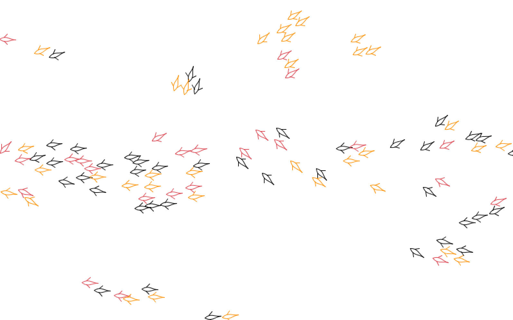

Demonstrates a simple simulation of schooling/swarming behavior.

This simulates a school of fish that exhibit three bottom-up behaviors:

- A fish wants to move towards the center of its neighbors. This encourages them to
get cozy.
- A fish wants to move away from any fish that's encroaching on its personal space.
That is, don't get too cozy.
- A fish wants to turn towards the average direction of its neighbors. This causes
neighbors to swim in the same direction.
