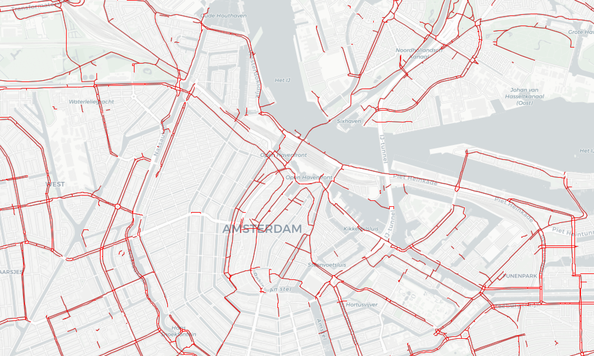

# OpenStreetMap Bicycle Path Demo

A simple example that shows how to request bicycle paths with the Spatial Pixel
`openstreetmap` library.

Like the other examples, this creates an `OpenStreetMap` object to handle the query, then
wraps it in a custom `SlippyLayer` object to enable a `SlippyMapper` object to render it.
The query uses `Relation` and `Way` objects to request various data tagged in various
ways that represent bicycle paths.