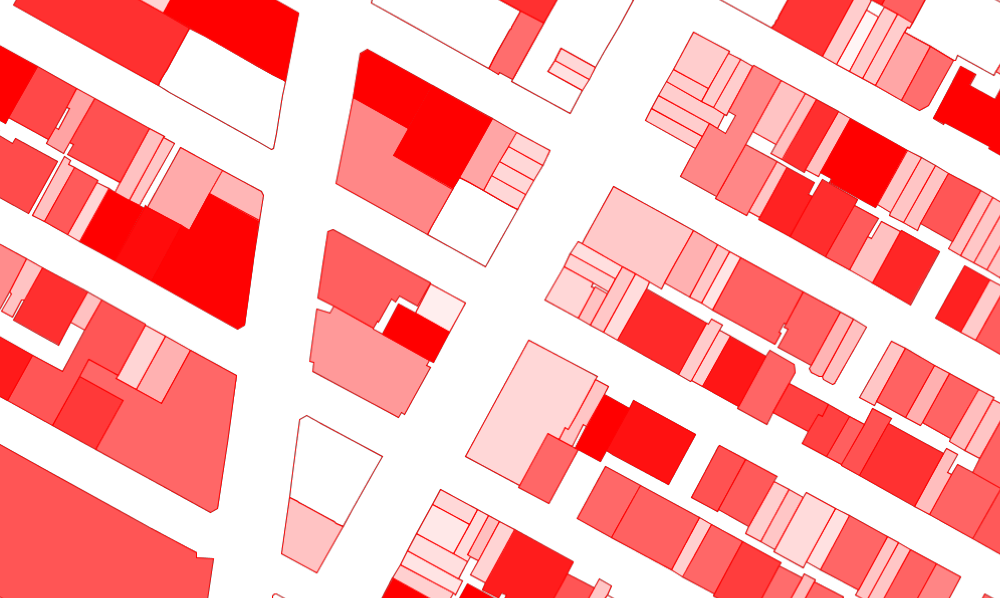

# OpenStreetMap Buildings Example

An example showing how to request and draw building outlines with the Spatial Pixel
`openstreetmap` library.

This example creates an `OpenStreetMap` instance and adds a `Way` query that represents 
`way[building]` in [Overpass QL](https://wiki.openstreetmap.org/wiki/Overpass_API/Overpass_QL). The corresponding 
`SlippyLayer` object accepts a styler function responsible for establishing the render 
style for the given object.

The render style is a red outline plus a fill based on the height of the building as specified by either the "height" or "building:levels" tag in the OSM data.
