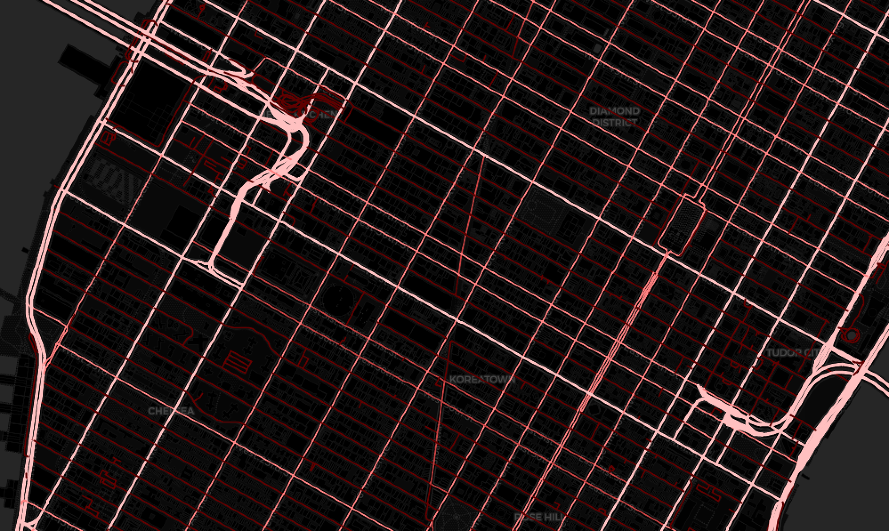

# OpenStreetMap Streets Demo

A simple demo to query OpenStreetMap using the Spatial Pixel `openstreetmap` library.

The sample creates an `OpenStreetMap` object that represents the query. You can either provide a raw
query to this object using the OSM query language, or use the provided query primitives to represent
a query. The sample does the latter by instantiating a `Way` object that specifies types of `highway`
path tags to query. [Docs here](https://wiki.openstreetmap.org/wiki/Map_Features#Paths)
